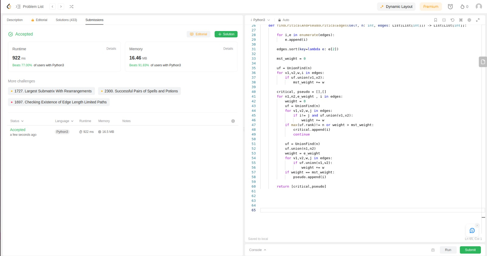

# Grafos2_LeetProblems

# LeetCodeExercicios

**Número da Lista**: 1 
**Conteúdo da Disciplina**: Grafos2 

## Alunos
|Matrícula | Aluno |
| -- | -- |
| 21/1039312| Danilo Carvalho Antunes |

## Sobre 
Este repositório contém a resolução de um exercício do [LeetCode](https://leetcode.com/) relacionados a Union-Find, Arvoré geradora minima e Kruskal.

## Screenshots

_ScreenShot1_

_ScreenShot2_

## Exercicio 1489. Find Critical and Pseudo-Critical Edges in Minimum Spanning Tree

Dificuldade: Hard  
Link: [Find Critical and Pseudo Critical Edges in Minimum Spanning Tree](https://leetcode.com/problems/find-critical-and-pseudo-critical-edges-in-minimum-spanning-tree/description/)

## Instalação 
**Linguagem**: Python 

Caso queira testar localmente é necessário ter o python instalado
## Uso 
Para verificar o funcionamento basta abrir o link do exercicio e copiar o código referente a questão, e logo após realizar o envio. Caso queira verificar localmente, é necessário adicionar a chamada da função principal com seus devidos paramêtros. para rodar basta utilizar o comando:

`python3 NomeDoArquivo.py`
